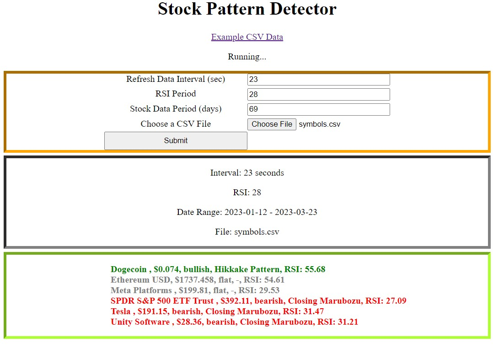

# Stock Pattern Detector

## Description
A Flask application for detecting market patterns.

## Setup
<ul>
<li>Recommeded to create a virtual environment</li>
<li>pip install -r requirements.txt</li>
<li>If errors occur when installing ta-lib, wrapper may be needed which can be downloaded <a href="https://www.lfd.uci.edu/~gohlke/pythonlibs/#ta-lib">here</a></li>
</ul>

## Run
flask run

## Screenshot

## Disclaimer
The stock and crypto markets are very risky. I am not a financial advisor. 
I am not responsible or liable for how you decide to use the program or source code.